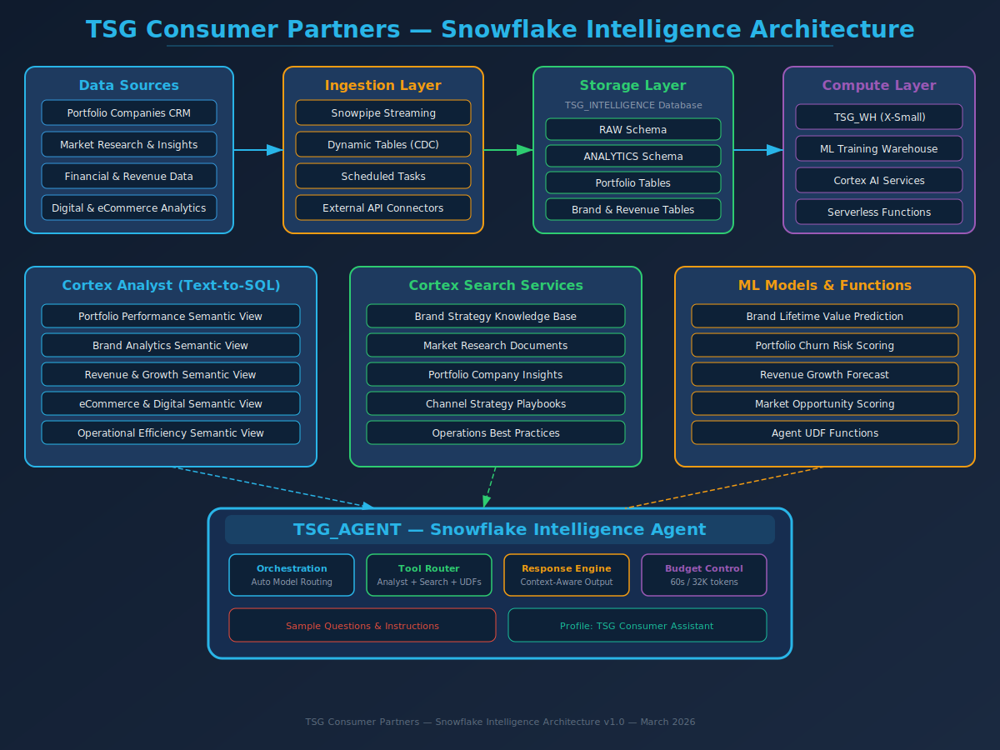
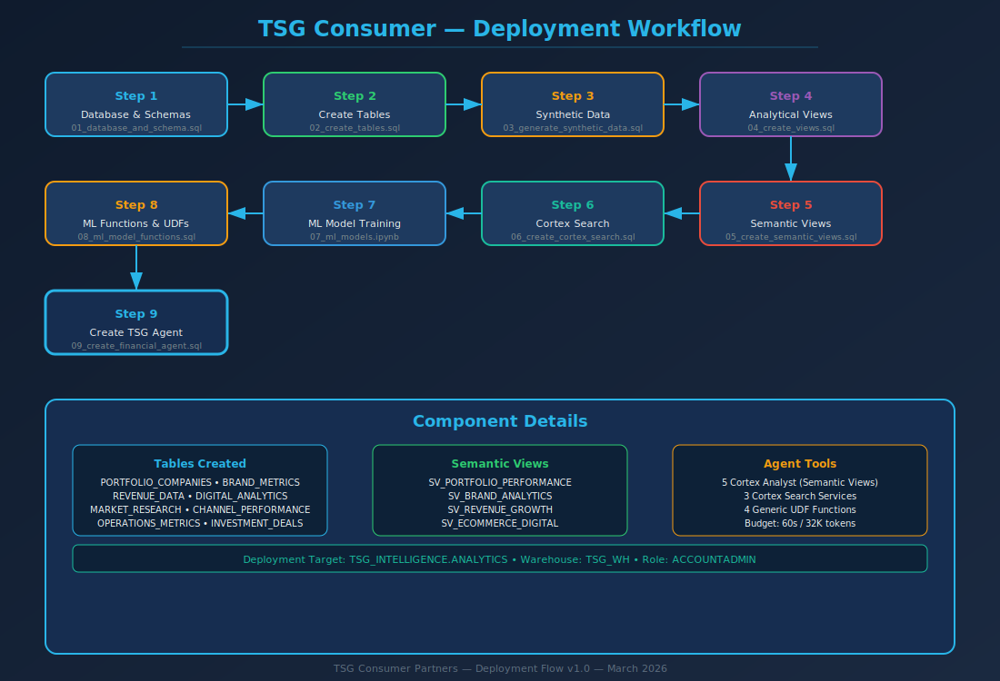
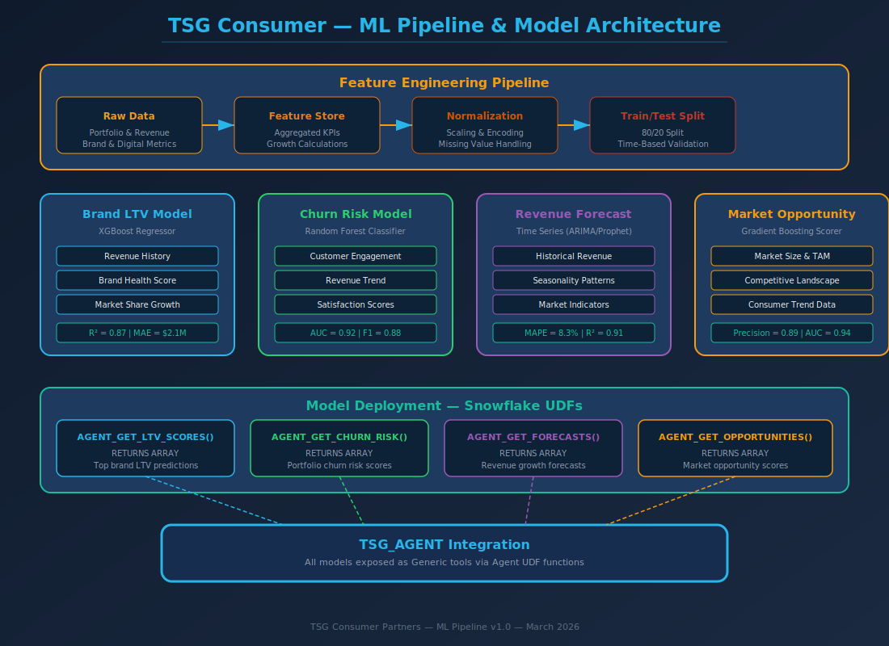

# TSG Consumer Partners — Agent Setup Guide

## Overview

This guide walks through deploying the TSG Intelligence Agent on Snowflake. The agent provides portfolio analytics, brand insights, revenue forecasting, and market intelligence for TSG Consumer Partners' 12 active portfolio companies.

## Architecture



## Prerequisites

- Snowflake account with ACCOUNTADMIN role
- Cortex Agent, Cortex Search, and Cortex Analyst enabled
- A warehouse (TSG_WH or equivalent)

## Deployment Steps



### Step 1: Database & Schema Setup

```sql
-- Run: sql/setup/01_database_and_schema.sql
-- Creates: TSG_INTELLIGENCE database with RAW, ANALYTICS, SEARCH, MODELS, AGENT schemas
-- Creates: TSG_WH warehouse (X-Small, auto-suspend 60s)
```

### Step 2: Create Tables

```sql
-- Run: sql/setup/02_create_tables.sql
-- Creates 9 tables:
--   PORTFOLIO_COMPANIES — Master company data (12 companies)
--   BRAND_METRICS — Monthly brand health scores
--   REVENUE_DATA — Quarterly revenue by channel/region
--   DIGITAL_ANALYTICS — eCommerce and digital metrics
--   MARKET_RESEARCH — Competitive intelligence and market sizing
--   CHANNEL_PERFORMANCE — Sales channel breakdowns
--   OPERATIONS_METRICS — Supply chain and operational health
--   INVESTMENT_DEALS — Deal terms, valuations, projected returns
--   BRAND_STRATEGY_DOCS — Strategy documents and playbooks
```

### Step 3: Load Synthetic Data

```sql
-- Run: sql/data/03_generate_synthetic_data.sql
-- Populates all tables with realistic consumer PE portfolio data
-- ~12 portfolio companies, 2022-2025 time range
```

### Step 4: Create Analytical Views

```sql
-- Run: sql/views/04_create_views.sql
-- Creates 6 analytical views:
--   V_PORTFOLIO_PERFORMANCE
--   V_BRAND_ANALYTICS
--   V_REVENUE_GROWTH
--   V_ECOMMERCE_DIGITAL
--   V_OPERATIONAL_EFFICIENCY
--   V_BRAND_STRATEGY_KNOWLEDGE
```

### Step 5: Create Semantic Views

```sql
-- Run: sql/views/05_create_semantic_views.sql
-- Creates 5 semantic views for Cortex Analyst:
--   SV_PORTFOLIO_PERFORMANCE — Revenue, margins, deal metrics
--   SV_BRAND_ANALYTICS — Brand health, NPS, sentiment, market research
--   SV_REVENUE_GROWTH — Channel performance and growth trends
--   SV_ECOMMERCE_DIGITAL — Website, conversion, ROAS, CAC metrics
--   SV_OPERATIONAL_EFFICIENCY — Supply chain, fulfillment, cost structure
```

### Step 6: Create Cortex Search Services

```sql
-- Run: sql/search/06_create_cortex_search.sql
-- Creates 3 search services:
--   BRAND_STRATEGY_SEARCH — Strategy docs and playbooks
--   MARKET_RESEARCH_SEARCH — Market research and competitive intelligence
--   PORTFOLIO_KNOWLEDGE_SEARCH — Company descriptions and deal notes
```

### Step 7: ML Model Training (Optional)

```
-- Open: notebooks/07_ml_models.ipynb in Snowflake Notebooks
-- Trains 4 models: Brand LTV, Churn Risk, Revenue Forecast, Market Opportunity
-- Note: The SQL UDFs in Step 8 work independently of this notebook
```

### Step 8: Deploy ML Functions

```sql
-- Run: sql/models/08_ml_model_functions.sql
-- Creates 4 SQL UDF functions:
--   AGENT_GET_LTV_SCORES() — Brand lifetime value predictions
--   AGENT_GET_CHURN_RISK() — Portfolio churn risk scores
--   AGENT_GET_FORECASTS() — Revenue growth forecasts
--   AGENT_GET_OPPORTUNITIES() — Market opportunity scores
```

### Step 9: Create the Agent

```sql
-- Run: sql/agent/09_create_financial_agent.sql
-- Creates: TSG_INTELLIGENCE.AGENT.TSG_AGENT
-- Configures 12 tools:
--   5 Cortex Analyst (semantic views)
--   3 Cortex Search (document retrieval)
--   4 Generic (ML UDF functions)
```

## Agent Configuration

| Setting | Value |
|---------|-------|
| Orchestration Model | claude-4-sonnet |
| Time Budget | 60 seconds |
| Token Budget | 32,000 tokens |
| Database | TSG_INTELLIGENCE |
| Warehouse | TSG_WH |

## Agent Tools

| Tool | Type | Description |
|------|------|-------------|
| portfolio_performance_analyst | Cortex Analyst | Revenue, margins, deal metrics |
| brand_analytics_analyst | Cortex Analyst | Brand health, NPS, sentiment |
| revenue_growth_analyst | Cortex Analyst | Channel performance, growth |
| ecommerce_digital_analyst | Cortex Analyst | Digital marketing, eCommerce |
| operational_efficiency_analyst | Cortex Analyst | Supply chain, operations |
| brand_strategy_search | Cortex Search | Strategy docs and playbooks |
| market_research_search | Cortex Search | Market research reports |
| portfolio_knowledge_search | Cortex Search | Company descriptions, deal notes |
| get_ltv_scores | Generic (UDF) | Brand LTV predictions |
| get_churn_risk | Generic (UDF) | Churn risk scoring |
| get_forecasts | Generic (UDF) | Revenue forecasts |
| get_opportunities | Generic (UDF) | Market opportunity scores |

## ML Models



## Verification

After deployment, test the agent with these queries:

1. "Which portfolio companies have the strongest revenue growth?"
2. "What is PureGlow Beauty's brand health trend?"
3. "Show me the churn risk scores for all companies"
4. "What does our market research say about functional beverages?"
5. "Compare eCommerce conversion rates across the apparel brands"

## Troubleshooting

| Issue | Resolution |
|-------|------------|
| Agent not responding | Verify TSG_WH is running and ACCOUNTADMIN role is active |
| Semantic view errors | Re-run 05_create_semantic_views.sql; ensure base views exist |
| Search returns empty | Verify data was loaded in Step 3; check search service status |
| UDF function errors | Re-run 08_ml_model_functions.sql; verify table data exists |
